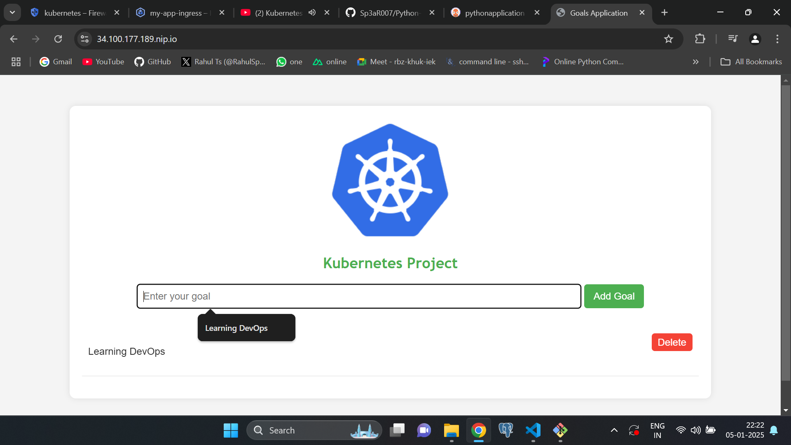

A Python application with Docker containerization, Kubernetes Orchestration, Github Actions CI, ArgoCD for CD and Nginx ingress for routing and external access.

# Docker Build

## Create Docker image
```
docker build --no-cache --platform=linux/amd64 -t sp3ar007/pythonapp .
```

## Run the container locally

```
docker run --name python-app -p 8080:8080 sp3ar007/pythonapp
```

# Kubernetes Deployment

## Install CloudnativePG Postgres Database
```
kubectl apply --server-side -f \
  https://raw.githubusercontent.com/cloudnative-pg/cloudnative-pg/release-1.23/releases/cnpg-1.23.1.yaml
```

## Create secret for application and database
```
kubectl apply -f deploy/secret.yaml
```

## create Postgres Database cluster
```
kubectl apply -f deploy/postgres-cluster.yaml
```


## Exec into pod to create table

```
kubectl exec -it my-postgresql-1 -- psql -U postgres -c "ALTER USER goals_user WITH PASSWORD 'new_password';"
kubectl port-forward my-postgresql-1 5432:5432
PGPASSWORD='new_password' psql -h 127.0.0.1 -U goals_user -d goals_database -c "

CREATE TABLE goals (
    id SERIAL PRIMARY KEY,
    goal_name VARCHAR(255) NOT NULL
);
"
```

## Create kubernetes deployment and service
```
kubectl apply -f deploy/deploy.yaml
kubectl apply -f deploy/service.yaml
```

## Install CERT MANAGER
```
kubectl apply -f https://github.com/cert-manager/cert-manager/releases/download/v1.14.5/cert-manager.yaml
```

## Install nginx ingress controller 
```
kubectl apply -f https://raw.githubusercontent.com/kubernetes/ingress-nginx/controller-v1.9.4/deploy/static/provider/cloud/deploy.yaml
```

## Install Metrics server
```
kubectl apply -f https://github.com/kubernetes-sigs/metrics-server/releases/latest/download/components.yaml
```

## Create ingress for deployment
```
kubectl apply -f deploy/ingress.yaml
```


### Create certificate for the tls access and also issue the certificate for the domain name
```
kubectl apply -f deploy/certificate.yaml
kubectl apply -f deploy/cluster_issuer.yaml
```

## Create argocd namespace and Install ArgoCD.
```
kubectl create namespace argocd
kubectl apply -n argocd -f https://raw.githubusercontent.com/argoproj/argo-cd/stable/manifests/install.yaml
kubectl patch svc argocd-server -n argocd -p '{"spec": {"type": "LoadBalancer"}}'
kubectl get secret -n argocd argocd-initial-admin-secret -oyaml

```

# Deployment Details with SSL Encryption
 
